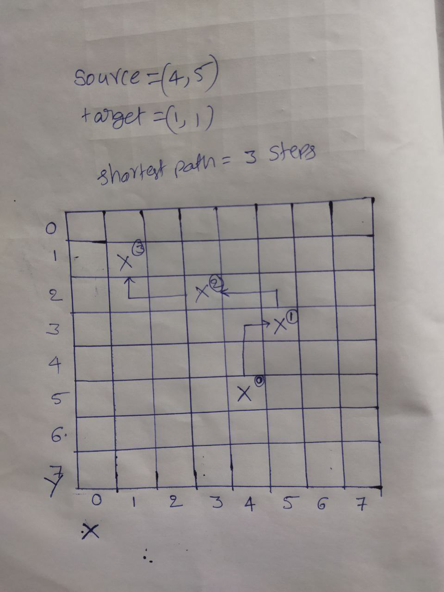

# Shortest Path of Knight

## Algorithm

1. Create an empty Queue
2. Insert the source node and initial distance as 0 (zero)
3. till the Queue is empty: <br/>
   &nbsp;&nbsp;&nbsp;&nbsp; i. Dequeue the Node <br/>
   &nbsp;&nbsp;&nbsp;&nbsp; ii. If the popped node is our target return the distance. <br/>
   &nbsp;&nbsp;&nbsp;&nbsp; iii. Else mark the &nbsp;node as visited, for each of all possible movements for knight, enqueue each valid movement with distance increased by 1.

# Run the Program

```Javascript
node shortestpath.js
```

```Javascript
const ROW = [2, 2, -2, -2, 1, 1, -1, -1]
const COL = [-1, 1, 1, -1, 2, -2, 2, -2]
```

the above arrays will help us to move the all possible positions of a Knight.

Suppose if our knight is at (x,y)
possible nodes are:<br/>
(x+2, y-1)<br/>
(x+2, y+1)<br/>
(x-2, y+1)<br/>
(x-2, y-1)<br/>
(x+1, y+2)<br/>
(x+1, y-2)<br/>
(x-1, y+2)<br/>
(x-1, y-2)<br/>

# How I considered the 8 X 8 Chess board with picture example.


